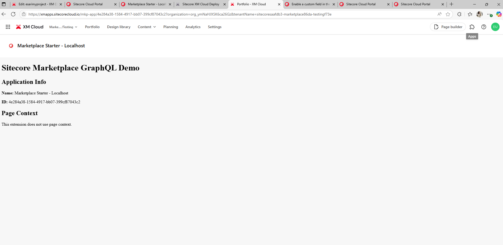
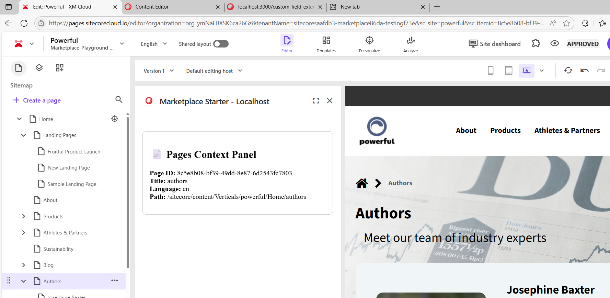

# XM Cloud Marketplace Extension Starter

This project is a Next.js starter template for building Sitecore XM Cloud Marketplace extensions. It demonstrates five extension points: **Custom Field**, **Dashboard Widget**, **Fullscreen**, **Pages Context Panel**, and **Standalone**. Each extension point has its own UI and integration with the Sitecore Marketplace SDK.

---

## Project Structure

```
xmcloud-marketplace-starter/
├── pages/
│   ├── custom-field-extension/
│   │   └── index.tsx
│   ├── dashboard-widget-extension/
│   │   └── index.tsx
│   ├── fullscreen-extension/
│   │   └── index.tsx
│   ├── pages-contextpanel-extension/
│   │   └── index.tsx
│   └── standalone-extension/
│       └── index.tsx
├── src/
│   └── utils/
│       └── hooks/
│           └── useMarketplaceClient.ts
├── public/
├── package.json
├── tsconfig.json
├── next.config.js
└── ...
```

---

## Extension Points

### 1. Custom Field Extension

- **Location:** `pages/custom-field-extension/index.tsx`
- **URL:** [http://localhost:3000/custom-field-extension](http://localhost:3000/custom-field-extension)
- **Description:**  
  Provides a color picker UI for Sitecore XM Cloud custom fields.
  - Initializes the Marketplace SDK client.
  - Fetches the current field value using `client.getValue()`.
  - Lets users select a color and saves it using `client.setValue(newColor)`.
  - Displays loading and error states.


---

### 2. Dashboard Widget Extension

- **Location:** `pages/dashboard-widget-extension/index.tsx`
- **URL:** [http://localhost:3000/dashboard-widget-extension](http://localhost:3000/dashboard-widget-extension)
- **Description:**  
  Displays a widget in the XM Cloud dashboard.
  - Initializes the Marketplace SDK client.
  - Shows relevant dashboard information or actions.
  - Handles loading and error states.


---

### 3. Fullscreen Extension

- **Location:** `pages/fullscreen-extension/index.tsx`
- **URL:** [http://localhost:3000/fullscreen-extension](http://localhost:3000/fullscreen-extension)
- **Description:**  
  Provides a fullscreen experience for advanced extension scenarios.
  - Initializes the Marketplace SDK client.
  - Renders content in fullscreen mode.
  - Handles loading and error states.



---

### 4. Pages Context Panel Extension

- **Location:** `pages/pages-contextpanel-extension/index.tsx`
- **URL:** [http://localhost:3000/pages-contextpanel-extension](http://localhost:3000/pages-contextpanel-extension)
- **Description:**  
  Displays context information about the current page in the XM Cloud Pages editor.
  - Initializes the Marketplace SDK client.
  - Subscribes to `pages.context` using the SDK.
  - Shows page ID, title, language, and path.
  - Handles loading and error states.



---

### 5. Standalone Extension

- **Location:** `pages/standalone-extension/index.tsx`
- **URL:** [http://localhost:3000/standalone-extension](http://localhost:3000/standalone-extension)
- **Description:**  
  Runs as a standalone app outside of other extension points.
  - Initializes the Marketplace SDK client.
  - Can be used for custom tools or utilities.
  - Handles loading and error states.


---

## Shared Utilities

- **Marketplace Client Hook:**  
  - Location: `src/utils/hooks/useMarketplaceClient.ts`
  - Provides a reusable React hook for initializing and interacting with the Sitecore Marketplace SDK client.
  - Handles initialization, error, and loading states.

---

## Getting Started

1. **Install dependencies:**
   ```sh
   npm install
   ```

2. **Run the development server:**
   ```sh
   npm run dev
   ```

3. **Access extension points in your browser:**
   - [http://localhost:3000/custom-field-extension](http://localhost:3000/custom-field-extension)
   - [http://localhost:3000/dashboard-widget-extension](http://localhost:3000/dashboard-widget-extension)
   - [http://localhost:3000/fullscreen-extension](http://localhost:3000/fullscreen-extension)
   - [http://localhost:3000/pages-contextpanel-extension](http://localhost:3000/pages-contextpanel-extension)
   - [http://localhost:3000/standalone-extension](http://localhost:3000/standalone-extension)

---

## Notes

- The app uses the Sitecore Marketplace SDK and is designed to run inside an iframe provided by XM Cloud Marketplace for full functionality.
- Shared hooks and utilities are located in `src/utils/hooks`.
- You can add more extension points by creating new folders inside `pages`.
- Each folder in `pages` becomes a route, and each `.tsx` file inside those folders becomes a sub-route.

---